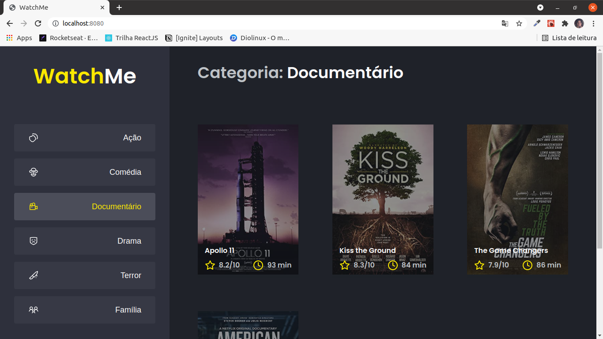

## Introdução
WatchMe é um projeto para salvar filmes que eu gostaria de assistir um dia.
## Primeiro Acesso
### Clonando o projeto
```
$ git clone https://github.com/matheusfd3/watch-me-react.git
```
### Baixando as dependências
Na pasta do projeto execute o comando abaixo com o [Yarn](https://yarnpkg.com/lang/pt-br/).
```
$ yarn install
```
### Fake API com JSON Server
Vamos utilizar o JSON Server para simular uma API que possui as informações de gêneros e filmes.
```
$ yarn server
```
### Rodando no localhost
```
$ yarn dev
```
Acesse [http://localhost:8080/](http://localhost:8080/).
### **Imagem**
<h2 align="center">
  
</h2>
